=======================
Reference documentation
=======================

New line (Enter)
================

Tab
===
Tabs are used to create blocks of commands. For example it is used in order to specify what commands should happen if a condition is true or what commands should be executed n-times.

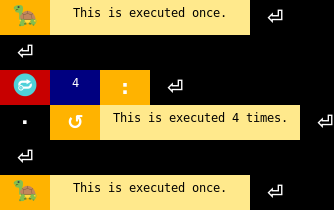

Comment
=======

Comments are icons with an editable label.
Their purpose is to explain parts of the program.

Go forward
==========

Moves the turtle forward.

**Parameters**

``NUMBER`` Distance in pixels (default: 30)

Turn left
=========

Turns the turtle left.

**Parameters**

``NUMBER`` Angle in degrees (default: 90)

Turn right
==========

Turns the turtle right.

**Parameters**

``NUMBER`` Angle in degrees (default: 90)

Set heading angle
=================

Sets the heading angle of the turtle.

**Parameters**

``NUMBER`` Angle in degrees (default: 0)

Speed
=====

Set the speed of the turtle to an integer value (float values are rounded) in range 0..10.
Zero represents the fastest speed (no animations).
Otherwise greater number means faster speed.
If input is smaller than 0.5 or greater than 10 the speed is set to zero.

**Parameters**

``NUMBER`` Speed (default: 1)

Number
======

This editable icon represents an integer number.

String
======
This editable icon represents a string.

Length of (string, list etc)
============================

Gets the length of the object.
For example, number of items in a collection or count of characters in a string.

**Parameters**

``OBJECT`` The object whose length is to be obtained

Set position
============

Set position of the turtle. The movement is animated.

**Parameters**

``NUMBER`` The new X coordinate (default: 0)

``NUMBER`` The new Y coordinate (default: 0)

Set pen color
=============

Set color of Turtle's pen. Without any parameters the color is set to black.

**Parameters**

``COLOR`` Pen color.

``COLOR`` Fill color.

**Color specification options**

``STRING`` Color string, such as "red", "yellow", or "#33cc8c"

``TUPLE(r, g, b)`` Color tuple that represents RGB color. Each of r, g and b must be in the range 0..255.

Lift the pen up – no drawing when moving.
=========================================
Do not not draw when the turtle moves.

Put the pen down – drawing when moving.
=======================================
Draw when the turtle moves.

Pen properties
==============
Return or set the pen’s attributes. All the parameters are optional.

**Parameters**

``BOOL`` "shown" `See Hide turle <#hide-turtle>`_

``BOOL`` "pendown" `See Pull the pen up <#pull-the-pen-up-no-drawing-when-moving>`_

``STRING | TUPLE(r, g, b)`` "pencolor" `See Set Pen Color <#set-pen-color>`_

``STRING | TUPLE(r, g, b)`` "fillcolor" Color that is used to fill shapes. Same format as "pencolor".

``NUMBER`` "pensize" Size of line that is Turtle drawing.

``NUMBER`` "speed" See `Speed <#speed>`_.

``STRING``  "resizemode" Adaption of the turtle’s appearance. Possible values: "auto" or "user" or "noresize"

``NUMBER, NUMBER`` "stretchfactor" Scale of turtle's shape. "resizemode" must be set to "user".

``NUMBER`` "outline" The width of the shapes’s outline. "resizemode" must be set to "user".

``NUMBER`` "tilt" Rotate the turtleshape by angle from its current tilt-angle.

Left parenthesis
================
Used to specify parameters of commands.
The example usage is "command(parameter, parameter)".

Argument separator (Comma)
==========================

Right parenthesis
=================
See `here <#left-parenthesis>`_.

Hide turtle
===========

Hides the turtle.

Show turtle
===========

Shows the turtle.

Write text on screen
====================

**Parameters**

``STRING`` Text to write

``FONT`` "font" A `font <#font-property-or-editable>`_. (optional)

``STRING`` "align" Possible values: 'left', 'center', 'right'. (optional)

Begin fill
==========
To be called just before drawing a shape to be filled.
Call this, draw a shape (e.g. rectangle) and then call End fill.

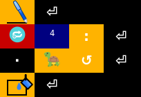

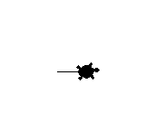

   Result

End fill - fill the drawn shape
===============================
See `Begin fill <#begin-fill>`_.

Clear turtle screen
===================
Delete the turtle’s drawings from the screen

Get or set the color of the screen
==================================

**Parameters**

``STRING | TUPLE(r, g, b)`` The new color of the screen. See `this <#set-pen-color>`_ to check out how to specify colors. Do no pass any value to this parameter to get current color.

Get or set the background picture of the screen
===============================================

**Parameters**

``PICTURE | STRING`` The new backgroud picture. It cloud be a string path name or an `image <#image-file>`_.

Load scene (file)
=================
If no scene specified this will only clear current scene.

**Parameters**

``STRING`` Path to scene file. (default: None)

Image file
==========
Editable object that represents an image file.
Drag and drop an image from file explorer to your program directly or put this icon into the program and enter path by pressing F2 manually.

Set turtle shape
================
You can change turtle's appearance with this command.

**Variants (overloads)**

``STRING`` Set turtle appearance to a predefined shape 'arrow', 'turtle', 'circle', 'square', 'triangle', 'classic'.

``IMAGE``  Set turtle apperance to an `image <#image-file>`_.

Create new turtle
=================
This creates a turtle. The result of this function should be stored in a variable.
All turtle functions can be accessed from this variable.

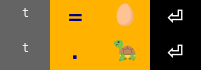

    Creates a new turtle and moves it forward.

Get the predefined turtle object
================================
Returns predefined turtle object. It works then just like turtle object returned by `Create new turtle <#create-new-turtle>`_.

Place image at the position of the turtle
=========================================

**Parameters**

``Image`` An `image <#image-file>`_.

``Turtle`` A turtle object to place the image at. (optional)

Sleep
=====
If "seconds" is None then the program will wait until a key is pressed or mouse is clicked.

``NUMBER`` "seconds" Number of seconds to sleep. (default: None)

``BOOL`` "block" Block key press events while sleeping. This has no effect if "seconds" is None. (default: True)

Connect a function to handle collision (in circle collider of specified radius) between two turtles
===================================================================================================

``TURTLE`` Turtle object A.

``TURTLE`` Turtle object B.

``FUNCTION`` Callback. This function is called when collision occurs.

``NUMBER`` Collider size of turtle A. (default: 10)

``NUMBER`` Collider size of turtle B. (default: 10)

``OBJECT`` User data to pass to callback. (optional)

Connect a function to handle collision (in rectangle collider of specified size) between two turtles
====================================================================================================

``TURTLE`` Turtle object A.

``TURTLE`` Turtle object B.

``FUNCTION`` Callback. This function is called when collision occurs.

``TUPLE (width, height)`` Collider size of turtle A. (default: (15, 15))

``TUPLE (width, height)`` Collider size of turtle B. (default: (15, 15))

``OBJECT`` User data to pass to callback. (optional)

Undo the last turtle action
===========================
Undoes the last turtle action. For example removes drawen line and moves turtle to previous position.

Circle
======
Draws a circle with specified perimeter.

**Parameters**

``NUMBER`` Radius.

``NUMBER`` Extent - determines which part of the circle is drawn. (optional)

``NUMBER`` Steps - the number of steps tu use. If not given, it will be calculated automatically. May be used to draw regular polygons. (optional)

Turbo mode
==========
Turbo mode can hide turtle actions from the user. This is useful for example when prepairing scene.

**Parameters**

``NUMBER`` "turbo" There are three levels of turbo mode:

	0 - Off - Set default turtle speed.

	1 - On - Set maximal turtle speed.

	2 - Full - Set maximal turtle speed and disable screen updating. (User cannot see any action)

	3 - Doesn't mess with the default turtle. You can still use "do_no_render" parameter. (useful when using scenes)

	(default: False)

``BOOL`` "do_not_render" Disables screen updating. This is automatically set to True when "turbo" is level 2. (default: False)

``TURTLE`` "t" Use this turtle instead of the default one (when changing turtle speed).

Camera properties
=================
Changes position of the "camera" and also resizes the window of the program.

If "x" and "y" is not given then this command will just only resize the window.
If "width" or "height" is greater than the size of the screen then scrollbars are shown. Otherwise they are hidden.

**Parameters**

``NUMBER`` "x" X coordinate of camera. (optional)

``NUMBER`` "y" Y coordinate of camera. (optional)

``NUMBER`` "width" Width of the program window. (optional)

``NUMBER`` "hegiht" Height of the program window. (optional)

Connect a function to handle key presses
========================================
You can also use the functions dialog to create a new method and connect key preess signal to it automatically.

**Parameters**

``FUNCTION`` Callback. This is called when "key" is pressed.

``KEY`` "key" See `See <#key>`_.

Call a function after n miliseconds
===================================
Calls a function after n miliseconds.
You can put this command at the end of the callback and then call it once manually to call it repeatedly.

**Parameters**

``FUNCTION`` Callback. A function with no arguments.

``NUMBER`` Number of milliseconds to call the function after.

Number input
============
Pop up a dialog window for input of a number.

**Parameters**

``STRING`` Title of the window. (default: 'Number')

``STRING`` Prompt text. (default: 'Enter a number:')

``NUMBER`` "default" Default number. (optional)

``NUMBER`` "minval" Min value. (optional)

``NUMBER`` "maxval" Max value. (optional)

String input
============
Pop up a dialog window for input of a string.

**Parameters**

``STRING`` Title of the window. (default: 'String')

``STRING`` Prompt text. (default: 'Enter a string:')

Connect a function to handle mouse clicks
=========================================
You can also use the functions dialog to create a new method and connect mouse click signal to it automatically.

If "function" is None all event bindings are removed.
If "function" is a turtle object all events bindings are removed from it.

**Parameters**

``FUNCTION`` "function" Callback. Two variables - x and y are passed to tihs function. (default: None)

``NUMBER`` "btn" Number of the mouse-button. Defaults to left mouse button. (default: 1)

``TURTLE`` "turtle" If not None the callback will be called only if user clicked on the specified turtle. (default: None)

``BOOL`` "add" If True, a new binding will be added, otherwise it will replace a former binding. (optional)

Exit the program
================

**Parameters**

``NUMBER`` Program return code. (default: 0)

East (0°)
=========
Direction constant.

North (90°)
===========
Direction constant.

West (180°)
===========
Direction constant.

South (270°)
============
Direction constant.

Pi (3.14)
=========
The Pi (π) constant.

Get x coordinate
================
Gets current x coordinate of the turtle.

Get y coordinate
================
Gets current y coordinate of the turtle.

Return True if turtle is shown.
===============================

Sine
====
Return the sine of x radians.

``NUMBER`` Number x.

Cosine
======
Return the cosine of x radians.

``NUMBER`` Number x.

Tangent
=======
Return the tangent of x radians.

``NUMBER`` Number x.

Absolute value
==============
Return absolute value of x. Example results 3→3, -3→3.

``NUMBER`` Number x.

Convert angle from degrees to radians.
======================================
``NUMBER`` Angle.

Convert angle from radians to degrees.
======================================
``NUMBER`` Angle.

True
====
Represents always true condition.

False
=====
Represents always false condition.

Round a number
==============

``NUMBER`` "number" The number to be roundend.

``NUMBER`` "digits" The number of decimals to use when rounding the number. (default: 0)

Floor
=====
Return the largest integer not greater than x. E.g. 3.4→3.

``NUMBER`` Number x.

Ceil
====
Return the smallest integer not less than x. E.g. 3.4→4.

``NUMBER`` Number x.

Returns square root of n. Use ** for int powers.
================================================
Return square root of n. E.g. 16→4.

``NUMBER`` Number n.

For getting int powers you can use `** <#multiply>`_:

Returns the lowest value
========================

Returns the lowest value from specified numbers. You can either pass an array or pass the numbers as individual arguments.

**Variants (overloads)**

``NUMBER[]`` The numbers.

|

``NUMBER`` First number.

``NUMBER`` Second number.

``NUMBER`` ...

Returns the highest value
=========================

Returns the highest value from specified numbers. You can either pass an array or pass the numbers as individual arguments.

**Variants (overloads)**

``NUMBER[]`` The numbers.

|

``NUMBER`` First number.

``NUMBER`` Second number.

``NUMBER`` ...

None
====

None is used to define a null value or no value at all.
It is not the same as 0, False or an emtpy string.
It is a datatype of its own (NoneType).

Color (property or editable)
============================
This icon represents a color. You can edit it by pressing F2. If no color is set it represents color property.

When a color is set and it is placed standalone into the program it changes turtle's pen color.

Font (property or editable)
===========================
Represents a font description string. Press F2 to edit.

Key
===
Represents a key. Press F2 to edit.

Last loaded scene
=================

The name of the last scene that was loaded using the `Load scene (file) <#load-scene-file>__` command.

Left square bracket
===================
Square brackets are used create lists and to access list elements by index.

Example usage of list-related commands:

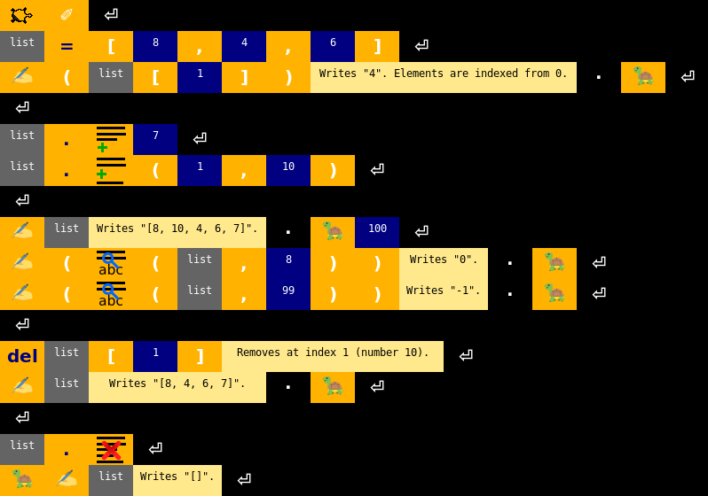

Right square bracket
====================
See `Left square bracket <#left-square-bracket>`__.

Delete an object
================
Deletes a varibale.

May be also used to remove items from list.
For more information about lists see `this <#left-square-bracket>`__.

Append an item to a list
========================

For more information about lists see `this <#left-square-bracket>`__.

**Parameters**

``OBJECT`` The item.

Insert an item to a list
========================

For more information about lists see `this <#left-square-bracket>`__.

**Parameters**

``NUMBER`` Index.

``OBJECT`` The item.

Clear list
==========
Removes all items from the list.

For more information about lists see `this <#left-square-bracket>`__.

Finds index of the occurence of an item in a list or in a string
================================================================
Returns -1 if no occurence found.

For more information about lists see `this <#left-square-bracket>`__.

**Parameters**

``LIST`` List to find items in.

``OBJECT`` Item. It could be almost any type.

``NUMBER`` Search start index. (default: 0)

``NUMBER`` Direction of search. (direction: 1)

Converts a string into lower case
=================================
Makes the whole string to contain only lower case letters.

**Parameters**

``STRING`` The string.

Converts a string into upper case
=================================
Makes the whole string to contain only upper case letters.

**Parameters**

``STRING`` The string.

Splits the string at the specified separator, and returns a list
================================================================
Returns the edited string.

**Parameters**

``STRING`` The separator.

Replaces a specified phrase with another specified phrase
=========================================================
Returns the edited string.

**Parameters**

``STRING`` Phrase to be replaced.

``STRING`` String to replace the phrase with.

If statement
============
With if statements you mark blocks of commands that will be executed only if a specified condition is true.

Else
====
Happens if condition in if statement was not true.
See `if statement <#if-statement>`_.

Begin block of commands
=======================
See `if statement <#if-statement>`_.

Equals
======

Not equals
==========

is less than
============

is greater than
===============

and
===

or
==

negation
========

Define a method
===============
Methods can be used in order to minimize repeating blocks of code. You can define a method and then call it from different places of the program.

You can also use the functions dialog to create functions and connect events to them with less effort.
There you can also simply create method usage blocks (`Object <#object>`__ with parenthesis).

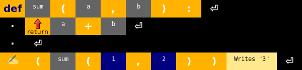

   Creates an example function called "sum" that returns sum of two numbers.

Return a value
==============

See `method <#define-a-method>`__.

Repeat block of commands
========================

This is used to repeat block of commands n times. Place a ``NUMBER`` after this command. If no number is specified the cycle will repeat infinitely.

Example (see also `Begin fill <#begin-fill>`__):

   Result

For loop
========
With for loop you can execute block of commands for every item in a list. List values are placed in a variable that you can use then.

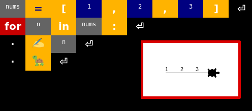

Is item in a list? / For all items in a collection.
===================================================
Checks wheter item is in a list. It is also used with `for loop <#for-loop>`_.

Repeat while the condition is true
==================================
Similiar to `Repeat block of commands <#repeat-block-of-commands>`__ but instead of a number you have to specify a condition.

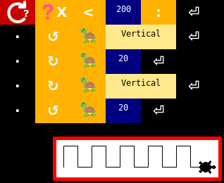

   Create a "wall" up to X coordinate 200.

Break out of a loop
===================
Stops iterating current loop and starts executing commands after the loop.

Continue with next iteration of a loop
======================================
Skips commands after this and starts next iteration of the loop (or exits to loop if this is the last iteration).

Object
======
Objects represent a variable or a method. You can edit its name by pressing F2 on it or by clicking "Edit value" in the context menu.

**Functions**

You can define a new method with `Define a method <#define-a-method>`__.
Then place parenthesis after this command just like with built-in functions.
Please note that you must you parenthesis even if you don't specify any parameters. Otherwise the object will be treaten as a variable.

**Varibales**

In variables can be stored various values like numbers or strings.
You have to assert a value to a variable and then you can use it in following code.

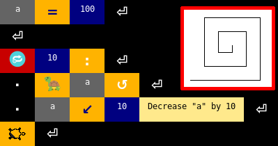

   Creates a "snail" using line length variable

Use variable as a global one
============================
Forces specified object to be used as a global variable. Global variables have persistent values all over the program.
For example if you change value of a global varibale in a function it will affect all occurences of the variable in the code.

If you would assign a value to a global varibale without marking it as global at the start of the function or program the program will only create a new local variable
that will be destroyed after the functions ends.

**Usage at the start of the program (recommended)**

If you mark variable as global outside of any commands block it will be marked as global automatically in all following functions.
This means that if you place this at the start of the program the variable will be accessible from anywhere.

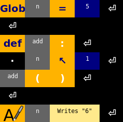

**Usage at start of functions**

You can also mark variable as global only for specific function. Just place this at the start of the function.

However if you only read from a global variable you don't have to use this command at all but is is recommended to use it in order to make code easier to read.

Assign value to a variable
==========================
See `Object <#object>`__.

Increase value by
=================
Increases value of a variable by specified amount.
Example:

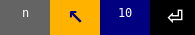

    Increases value of variable "n" by 10

Decrease value by
=================
Decreases value of a variable by specified amount.
Also see `Increase value by <#increase-value-by>`__.

Dot (use to access properties of an object)
===========================================
Some objects (e.g. turtles and lists) have properties like varibales or methods. Dot is used in order to access them.
To look at an example usage check out `Create new turtle <#create-new-turtle>`__.

Plus
====

Minus
=====

Multiply
========

Divide
======

Modulo
======

Type conversion
===============
Type conversion is used in order to make value of specified type from another value (e.g. a number from a string).

Example usage (note that the number 100 is a string):

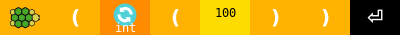

Direct Python code
==================
This icon represents custom Python code that you can change by editing the value of this icon.

As type
=======

Random number
=============
Return a ranom number in range.

**Parameters**

``NUMBER`` Minimum (default: 0)

``NUMBER`` Maximum (default: 100, excluding)

Return list of numbers in specified range
=========================================

**Parameters**

``NUMBER`` Start (default: 0)

``NUMBER`` End (default: 100)

Converts a character to an int value
====================================
Returns an integer represeting the character.
The result is a Unicode code point or a value of the byte when the argument is an 8-bit string.
You can also check out the `Unicode table <https://en.wikipedia.org/wiki/List_of_Unicode_characters#Latin_script>`__ to determine int values of various characters.

**Parameters**

``STRING`` The character. The string must be exactly one character long.

Converts an int value to a character
====================================
Returns a string representing a character whose Unicode code point is an integer.

**Parameters**

``NUMBER`` Int value of the character.

Create multidimensional list
============================
Creates a multidimensional list (multidimensional array/list of lists).
This can be used for example to store a grid of numbers.
The list must have at least one dimension.

**Parameters**

``OBJECT`` The initial value for all cells.

``NUMBER`` Size of the first dimension of the list.

``NUMBER`` ...

Try
===
Commands that are placed inside Try can raise exceptions that are then handled by `Except <#except>`__ without crashing the whole program.

Except
======

Raise exception
===============

Read all lines of a file
========================
Returns an array of strings.

**Parameters**

``STRING`` File path

Write lines to a file
=====================
Writes a string array to a file.

**Parameters**

``STRING`` File path

File dialog
===========
Opens a file dialog a lets user to choose a file.
Returns file path as string.

**Parameters**

``STRING`` "text" Text to show in the header of the dialog. (default: 'Choose a file')

``STRING`` "filter" File filter. Format: '[Filter name] | [File name pattern]'. (default: 'All files | \*')

``BOOL`` "save" Activate file save mode.

Check file exists
=================
Returns boolean.

**Parameters**

``STRING`` File path

Check directory exists
======================
Returns boolean.

**Parameters**

``STRING`` Directory path

Delete file or directory
========================
This deletes the specified directory or file.

**Parameters**

``STRING`` File/directory path.

Get files in DIRECTORY
======================
Returns a sorted list of subfiles in the specified directory.

**Parameters**

``STRING`` Directory path.

Get subdirs in DIRECTORY
========================
Returns a sorted list of subdirs in the specified directory.

**Parameters**

``STRING`` Directory path.

Get parent directory / the directory the item is located in
===========================================================
Returns the parent directory. E.g. for '/dir1/dir2/file' this returns '/dir1/dir2'.

**Parameters**

``STRING`` Path.

Get file name from path
=======================
Returns name of the file at path. E.g. for '/home/user' this returns 'user'.

**Parameters**

``STRING`` Path.

Get current timestamp
=====================
Return the time in seconds since the epoch as a float.

Convert timestamp to string
===========================
Returns a string that represents the timestamp.

Format codes:

+-----------+-------------------------------------------------------+-------------------------------+
| Directive | Meaning                                               | Example (English (US) locale) |
+===========+=======================================================+===============================+
| %a        | Weekday as locale’s                                   |                               |
|           | abbreviated name.                                     | Sun, Mon, …, Sat              |
+-----------+-------------------------------------------------------+-------------------------------+
| %A        | Weekday as locale’s full name.                        | Sunday, Monday, …,            |
|           |                                                       | Saturday                      |
+-----------+-------------------------------------------------------+-------------------------------+
| %w        | Weekday as a decimal number,                          | 0, 1, …, 6                    |
|           | where 0 is Sunday and 6 is                            |                               |
|           | Saturday.                                             |                               |
+-----------+-------------------------------------------------------+-------------------------------+
| %d        | Day of the month as a                                 | 01, 02, …, 31                 |
|           | zero-padded decimal number.                           |                               |
+-----------+-------------------------------------------------------+-------------------------------+
| %b        | Month as locale’s abbreviated name.                   | Jan, Feb, …, Dec              |
+-----------+-------------------------------------------------------+-------------------------------+
| %B        | Month as locale’s full name.                          | January, February,            |
|           |                                                       | …, December                   |
+-----------+-------------------------------------------------------+-------------------------------+
| %m        | Month as a zero-padded decimal number.                | 01, 02, …, 12                 |
+-----------+-------------------------------------------------------+-------------------------------+
| %y        | Year without century as a zero-padded decimal number. | 00, 01, …, 99                 |
+-----------+-------------------------------------------------------+-------------------------------+
| %Y        | Year with century as a decimal                        | 0001, 0002, …, 2013,          |
|           | number.                                               | 2014                          |
+-----------+-------------------------------------------------------+-------------------------------+
| %H        | Hour (24-hour clock) as a zero-padded decimal number. | 00, 01, …, 23                 |
+-----------+-------------------------------------------------------+-------------------------------+
| %I        | Hour (12-hour clock) as a                             | 01, 02, …, 12                 |
|           | zero-padded decimal number.                           |                               |
+-----------+-------------------------------------------------------+-------------------------------+
| %p        | Locale’s equivalent of either                         |                               |
|           | AM or PM.                                             | AM, PM                        |
+-----------+-------------------------------------------------------+-------------------------------+
| %M        | Minute as a zero-padded decimal number.               | 00, 01, …, 59                 |
+-----------+-------------------------------------------------------+-------------------------------+
| %S        | Second as a zero-padded                               | 00, 01, …, 59                 |
|           | decimal number.                                       |                               |
+-----------+-------------------------------------------------------+-------------------------------+
| %j        | Day of the year as a                                  | 001, 002, …, 366              |
|           | zero-padded decimal number.                           |                               |
+-----------+-------------------------------------------------------+-------------------------------+
| %U        | Week number of the year                               | 00, 01, …, 53                 |
|           | (Sunday as the first day of                           |                               |
|           | the week) as a zero padded                            |                               |
|           | decimal number. All days in a                         |                               |
|           | new year preceding the first                          |                               |
|           | Sunday are considered to be in                        |                               |
|           | week 0.                                               |                               |
+-----------+-------------------------------------------------------+-------------------------------+
| %W        | Week number of the year                               | 00, 01, …, 53                 |
|           | (Monday as the first day of                           |                               |
|           | the week) as a decimal number.                        |                               |
|           | All days in a new year                                |                               |
|           | preceding the first Monday                            |                               |
|           | are considered to be in                               |                               |
|           | week 0.                                               |                               |
+-----------+-------------------------------------------------------+-------------------------------+
| %c        | Locale’s appropriate date and time representation.    | Tue Aug 16 21:30:00           |
|           |                                                       | 2000                          |
+-----------+-------------------------------------------------------+-------------------------------+
| %x        | Locale’s appropriate date                             | 08/16/1988                    |
|           | representation.                                       |                               |
+-----------+-------------------------------------------------------+-------------------------------+
| %X        | Locale’s appropriate time                             | 21:30:00                      |
|           | representation.                                       |                               |
+-----------+-------------------------------------------------------+-------------------------------+
| %%        | A literal '%' character.                              | %                             |
+-----------+-------------------------------------------------------+-------------------------------+

**Parameters**

``NUMBER`` Timestamp.

``STRING`` Format of output string. (default: '%d/%m/%y %H:%M:%S')

Convert string to timestamp
===========================
For list of format codes see `Convert timestamp to string <#convert-timestamp-to-string>`__.

**Parameters**

``NUMBER`` String representing a date/time.

``STRING`` Format of the string. (default: '%d/%m/%y %H:%M:%S')

Create sound player for a file
==============================

Play tone (frequency/C-B, duration, wait for end)
=================================================

Play sound (file or sound player, volume - optional)
====================================================

Pause sound player
==================

is player playing
=================

Seek to given position in seconds
=================================

Get current position
====================

Get the duration of the media opened in player (returns zero if duration is unknown)
====================================================================================

Connect LED
===========

Connect RGB LED
===============

Connect Button
==============

Connect Input Device
====================

Connect PWM Output Device
=========================

Connect Digital Output Device
=============================

Turn on device
==============

Turn off device
===============

Value (input and output)
========================

Connect a function that is called when the device state changes to active
=========================================================================

Connect a function that is called when the device state changes to inactive
===========================================================================

